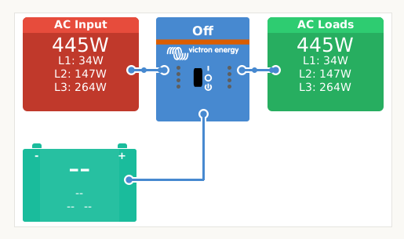

# dbus-mqtt-services
A [driver](https://github.com/victronenergy/venus/wiki/howto-add-a-driver-to-Venus) 
for [VenusOS](https://github.com/victronenergy/venus/wiki), which listens on a special 
MQTT topic and creates a new dbus-service as instructed in the MQTT-message. This allows 
you to create whatever dbus-service you desire without having to run special python-code 
on the VenusOS device.

Credits: Louis Van Der Walt's [dbus-serialbattery](https://github.com/Louisvdw/dbus-serialbattery)
was a great inspiration for this work.

## Example
The following example message published to the topic `W/dbus-mqtt-services` will generate a 
new battery service on the dbus (this is not a complete list og all parameters for a battery-service):

```
    {
      "service": "daly_bms_battery_1",
      "serviceType": "battery",
      "serviceInstance": 0,
      "dbus_data": [
        {
          "path": "/Mgmt/ProcessName",
          "value": "Daly Bms Bridge",
          "valueType": "string",
          "writeable": false
        },
        {
          "path": "/Mgmt/ProcessVersion",
          "value": "1.0",
          "valueType": "string",
          "writeable": false
        },
        {
          "path": "/Mgmt/Connection",
          "value": "Serial Uart Daly",
          "valueType": "string",
          "writeable": false
        },
        {
          "path": "/ProductId",
          "value": "0",
          "valueType": "integer",
          "writeable": false
        },
        {
          "path": "/ProductName",
          "value": "Daly Bms service",
          "valueType": "string",
          "writeable": false
        },
        {
          "path": "/FirmwareVersion",
          "value": "1.0",
          "valueType": "string",
          "writeable": false
        },
        {
          "path": "/HardwareVersion",
          "value": "1.0",
          "valueType": "string",
          "writeable": false
        },
        {
          "path": "/Connected",
          "value": "1",
          "valueType": "integer",
          "writeable": false
        },
        {
          "path": "/CustomName",
          "value": "Daly Bms service",
          "valueType": "string",
          "writeable": true
        },
        {
          "path": "/Info/BatteryLowVoltage",
          "value": "52.176",
          "valueType": "float",
          "writeable": false
        },
      ]
    }
```

see for further example devices in the examples folder

## Formatting

For formaating the values there are 2 additional field
`"digits": 3` is to indicate the number of digits in the value. (note, Victron does not always show all digits in the UI, this value provides the max digits visible)
`"unit": "kWh"` is to indicate the unit visible in the UI

## Note
The device is setup by the first message received for the device. If after initiation new paths are added, these will not be seen until a restart.
If you don't want a full reboot, you can restart the script with this command
`kill $(ps | grep dbus-mqtt-services | grep python | awk '{print $1}')`

## Install
The installation procedure requires [SSH root access](https://www.victronenergy.com/live/ccgx:root_access) to your VenusOS device.

    $ wget https://raw.githubusercontent.com/sebdehne/dbus-mqtt-services/master/etc/dbus-mqtt-services/installrelease.sh
    $ sh installrelease.sh
    $ reboot

## How to remove settings from 'localsettings'
In case your service creates an vrm-instance which you do not want, here is how to remove settings:

Stop the localsettings service

    $ svc -d /service/localsettings

Make a backup

    $ cd /data/conf
    $ cp settings.xml settings.xml.backup

Remove the settings as needed

    $ vi settings.xml

Bring the localsettings service back online

    $ svc -u /service/localsettings
    
Check the logs for any issues

    $ less /data/log/localsettings/current

## Screenshot of result

 

